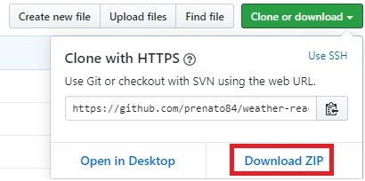

# bootcamp-gostack-desafios/desafio-1
Desafio 1 da GoStack 11


<h3 align="center">
  Desafio 1: Planejando meus estudos
</h3>

<p align="center">“Sua única limitação é você mesmo”!</blockquote>

<p align="center">
  

  <a href="https://rocketseat.com.br">
    
  </a>

  

  <a href="https://github.com/Rocketseat/bootcamp-gostack-desafios/stargazers">
    
  </a>
</p>

<p align="center">
  <a href="#rocket-sobre-o-desafio">Sobre o desafio</a>&nbsp;&nbsp;&nbsp;|&nbsp;&nbsp;&nbsp;
  <a href="#memo-licença">Licença</a>
</p>

## :sun_behind_rain_cloud: Projeto Weather com React-Redux

Projeto que utiliza React e Redux para fazer buscas climáticas em cidades brasileiras.

Para as previsões climáticas, são feitas chamadas assíncronas à API do **[OpenWeather](https://openweathermap.org/api)**

Portanto, para seu correto funcionamento, é necessário criar uma chave (key) no site acima e adicioná-la na variável `API_KEY` em `weather-react-redux/src/actions/index.js`

### :keyboard: Instalação e Execução

- Clone este repositório

```
> git clone https://github.com/prenato84/weather-react-redux.git
```

- Acesse a pasta principal do projeto

```
> cd weather-react-redux
```

- Instale as dependências

```
npm install
```

- Inicie o projeto

```
npm start
```

- Acesse o endereço `localhost:9000` em seu navegador.

### :man_technologist: Pré-requisitos do Ambiente

- Interpretador Javascriot **[Node JS](https://nodejs.org/en/download/)**
- Sistema de versionamento **[Git](https://git-scm.com/)**

OBS: caso não deseja utilizar o Git, pode baixar o projeto diretamente da página do GitHub 

<p align="center">
  
</p>


## :memo: Licença

Esse projeto está sob a licença MIT.

---

Feito com 💜 by <a href="https://www.linkedin.com/in/prenato84">Paulo Castro</a> :wave:


